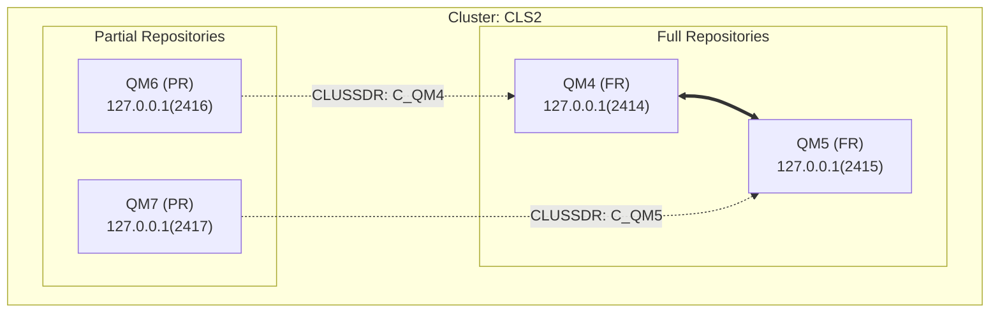

# 快速入門指南

## 🚀 快速開始

### Windows 使用者

1. **雙擊執行批次檔**
   ```
   run_analysis.bat
   ```
   
2. 程式會自動：
   - 分析當前目錄的所有 `.txt` 配置檔
   - 生成 `mq_topology.md` 檔案
   - 自動開啟結果檔案

### Linux/Mac 使用者

1. **賦予執行權限**
   ```bash
   chmod +x run_analysis.sh
   ```

2. **執行腳本**
   ```bash
   ./run_analysis.sh
   ```

3. **檢視結果**
   ```bash
   cat mq_topology.md
   ```

### 手動執行

```bash
# 分析當前目錄
python generate_mq_topology.py

# 分析指定目錄
python generate_mq_topology.py /path/to/config/files

# 指定輸出檔案名稱
python generate_mq_topology.py . my_custom_topology.md
```

## 📋 準備配置檔案

### 方法 1: 使用 dmpmqcfg 匯出

在每台 IBM MQ 伺服器上執行：

```bash
# 匯出 Queue Manager 配置
dmpmqcfg -a -m QM1 > QM1.txt
dmpmqcfg -a -m QM2 > QM2.txt
dmpmqcfg -a -m QM3 > QM3.txt
```

### 方法 2: 從現有檔案

將所有 Queue Manager 的配置檔案（.txt）放在同一個目錄中。

## 📊 檢視結果

生成的 `mq_topology.md` 檔案包含：

1. **Mermaid 圖表程式碼** - 可直接複製使用
2. **詳細摘要** - 列出所有 QM 的角色和連線資訊

### 在 Notion 中檢視

1. 開啟 `mq_topology.md`
2. 複製 Mermaid 程式碼區塊（包含 \`\`\`mermaid 標記）
3. 貼到 Notion 頁面中
4. Notion 會自動渲染圖表

### 在 Mermaid Live Editor 中檢視

1. 開啟 https://mermaid.live/
2. 複製 Mermaid 程式碼（不含 \`\`\`mermaid 標記）
3. 貼到編輯器中
4. 即時預覽圖表

### 在 VS Code 中檢視

1. 安裝 "Markdown Preview Mermaid Support" 擴充套件
2. 開啟 `mq_topology.md`
3. 按 `Ctrl+Shift+V` (Windows) 或 `Cmd+Shift+V` (Mac) 預覽

## 🎯 範例輸出

### 終端機輸出

```
============================================================
IBM MQ Cluster Topology Generator
============================================================

開始分析目錄: .
============================================================
正在分析檔案: QM4.txt
  - Queue Manager: QM4
  - 角色: FR
  - Clusters: ['CLS2']
正在分析檔案: QM5.txt
  - Queue Manager: QM5
  - 角色: FR
  - Clusters: ['CLS2']
============================================================
分析完成! 共找到 4 個 Queue Managers

[OK] Mermaid 圖表已儲存至: mq_topology.md
```

### 生成的架構圖



## 🔧 常見問題

### Q: 程式找不到配置檔案？

**A:** 確認：
- 檔案副檔名是 `.txt`
- 檔案在正確的目錄中
- 檔案包含有效的 MQSC 語法

### Q: 圖表顯示不正確？

**A:** 檢查：
- 配置檔案是否完整
- CLUSRCVR 和 CLUSSDR 通道是否正確定義
- CLUSTER 名稱是否一致

### Q: 如何分析多個叢集？

**A:** 程式會自動識別所有叢集，每個叢集會生成獨立的子圖。

### Q: 可以自訂輸出格式嗎？

**A:** 可以修改 `generate_mq_topology.py` 中的 `generate_mermaid()` 方法來自訂圖表樣式。

## 📚 更多資訊

詳細說明請參閱 [README.md](README.md)

## 💡 提示

- 定期更新配置檔案以保持架構圖最新
- 將生成的圖表加入文件庫供團隊參考
- 可以將此工具整合到 CI/CD 流程中自動生成文件