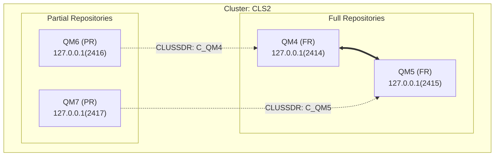

# IBM MQ Cluster Topology Generator

自動分析 IBM MQ 配置檔案（dmpmqcfg 匯出的 txt 檔）並生成 Mermaid 叢集拓樸架構圖。

## 功能特點

- ✅ 自動解析 MQSC 語法（支援斷行合併）
- ✅ 識別 Full Repository (FR) 和 Partial Repository (PR)
- ✅ 提取 CLUSRCVR 和 CLUSSDR 通道資訊
- ✅ 生成標準 Mermaid flowchart 語法
- ✅ 支援多個叢集的分析
- ✅ 輸出詳細的摘要資訊

## 系統需求

- Python 3.6 或更高版本
- 無需額外安裝套件（僅使用 Python 標準庫）

## 使用方法

### 基本用法

在包含 IBM MQ 配置檔案（.txt）的目錄中執行：

```bash
python generate_mq_topology.py
```

這會：
1. 分析當前目錄中所有的 `.txt` 檔案
2. 生成 `mq_topology.md` 檔案
3. 在終端機顯示 Mermaid 程式碼

### 指定目錄

```bash
python generate_mq_topology.py /path/to/config/files
```

### 指定輸出檔案

```bash
python generate_mq_topology.py . my_topology.md
```

### 完整參數

```bash
python generate_mq_topology.py <配置檔目錄> <輸出檔案名稱>
```

## 輸入檔案格式

程式接受 `dmpmqcfg` 命令匯出的配置檔案，例如：

```bash
dmpmqcfg -a -m QM4 > QM4.txt
dmpmqcfg -a -m QM5 > QM5.txt
```

## 輸出範例

### 終端機輸出

```
============================================================
IBM MQ Cluster Topology Generator
============================================================

開始分析目錄: .
============================================================
正在分析檔案: QM4.txt
  - Queue Manager: QM4
  - 角色: FR
  - Clusters: ['CLS2']
正在分析檔案: QM5.txt
  - Queue Manager: QM5
  - 角色: FR
  - Clusters: ['CLS2']
...
============================================================
分析完成! 共找到 4 個 Queue Managers

✓ Mermaid 圖表已儲存至: mq_topology.md
✓ 您可以將此檔案內容複製到 Notion 或 Mermaid Live Editor 中預覽
```

### Mermaid 圖表範例



## 圖表說明

### 節點類型

- **FR (Full Repository)**: 完整儲存庫，儲存整個叢集的完整資訊
- **PR (Partial Repository)**: 部分儲存庫，僅儲存本地相關的叢集資訊

### 連線類型

- `<==>` 雙向實線：FR 之間的雙向連線
- `-.->` 單向虛線：PR 到 FR 的初始連線（CLUSSDR）

### 節點標籤格式

```
QM名稱 (角色)
CONNAME位址
```

## 分析邏輯

1. **識別 Queue Manager 名稱**
   - 從檔案標頭的 `Queue manager name:` 欄位提取

2. **判斷角色**
   - `REPOS('ClusterName')` 且非空白 → Full Repository (FR)
   - `REPOS(' ')` 或未定義，但有 CLUSRCVR/CLUSSDR → Partial Repository (PR)
   - 無任何叢集配置 → Standalone

3. **提取連線資訊**
   - CLUSRCVR: 該 QM 的對外接收通道和位址
   - CLUSSDR: 該 QM 連接到其他 QM 的發送通道

4. **建立連線關係**
   - FR 之間自動建立雙向連線
   - PR 根據 CLUSSDR 的 CONNAME 連接到對應的 FR

## 檢視 Mermaid 圖表

生成的 Mermaid 程式碼可以在以下平台檢視：

1. **Notion**: 直接貼上 Mermaid 程式碼區塊
2. **Mermaid Live Editor**: https://mermaid.live/
3. **GitHub**: 在 Markdown 檔案中使用 mermaid 程式碼區塊
4. **VS Code**: 安裝 Mermaid 擴充套件

## 故障排除

### 找不到配置檔案

確保：
- 檔案副檔名為 `.txt`
- 檔案包含有效的 MQSC 語法
- 檔案路徑正確

### 無法識別 Queue Manager

檢查檔案是否包含：
```
* Queue manager name: QM_NAME
```

### 連線關係不正確

確認：
- CLUSRCVR 的 CONNAME 設定正確
- CLUSSDR 的 CONNAME 指向正確的 FR
- CLUSTER 名稱一致

## 授權

MIT License

## 作者

IBM MQ 系統架構師工具集