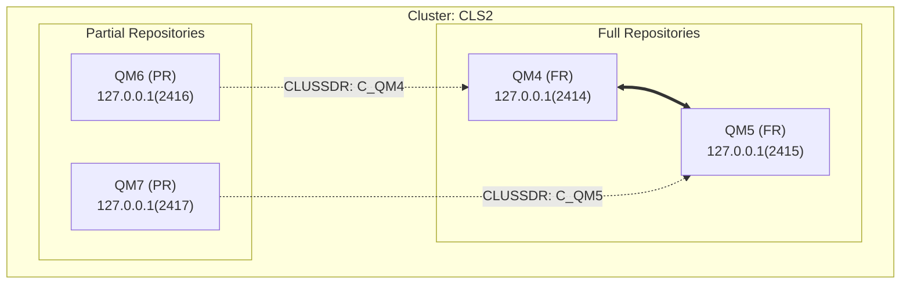

# IBM MQ Cluster Topology

## 摘要

### Cluster: CLS2

- **Full Repositories (2):** QM4, QM5
- **Partial Repositories (2):** QM6, QM7

#### QM4 (FR)
- CLUSRCVR: C_QM4 @ 127.0.0.1(2414)
- CLUSSDR: C_QM5 -> 127.0.0.1(2415)

#### QM5 (FR)
- CLUSRCVR: C_QM5 @ 127.0.0.1(2415)
- CLUSSDR: C_QM4 -> 127.0.0.1(2414)

#### QM6 (PR)
- CLUSRCVR: C_QM6 @ 127.0.0.1(2416)
- CLUSSDR: C_QM4 -> 127.0.0.1(2414)

#### QM7 (PR)
- CLUSRCVR: C_QM7 @ 127.0.0.1(2417)
- CLUSSDR: C_QM5 -> 127.0.0.1(2415)

